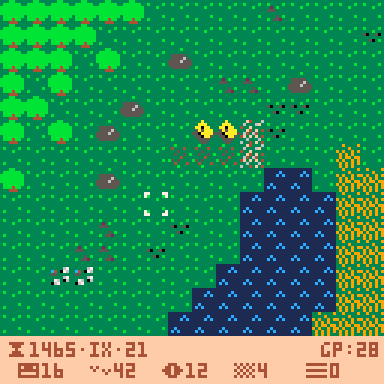

# 𝔗𝔦𝔫𝔶𝔥𝔬𝔩𝔡
A tiny town builder for the PICO-8 game console

This is a project to design a small town/city building game for the PICO-8 fantasy console by Lexaloffle Games. I've started this project to explore game design concepts and it is entirely possible that it will become a playable game some day. It might even be fun!

Fabian A. Scherschel,  
November 2023

### Credits

* Uses [JadeLombax's string-based graphics rendering system](https://www.lexaloffle.com/bbs/?tid=38829)
